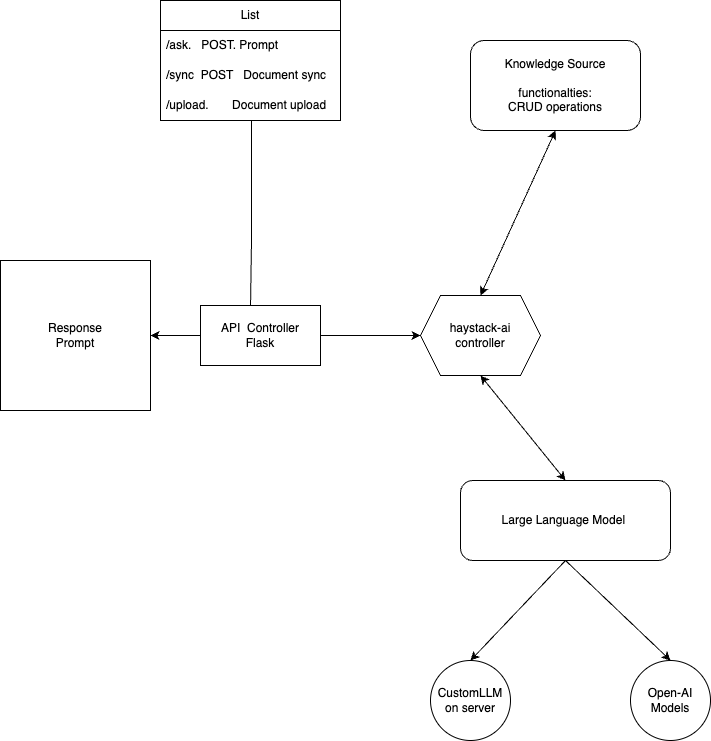

# Personal LLM by StranzersWeb Inc: System Design with Flask Backend

## Introduction

StranzersWeb Inc proudly presents its innovative Personal Large Language Model (LLM) application, employing Flask as the backend service to harness the capabilities of AI and Large Language Models for precise Question and Answer inference. The integration of Haystack-ai ensures efficient custom database management, enhancing the overall accuracy of data retrieval.

## System Workflow

1. **Dataset Loading:**
   - Flask handles the backend service responsible for loading the dataset into a Document store (ChromaStore, InMemoryStore, or Elastic Store).
   - Efficient storage and retrieval are facilitated by Flask's capabilities.

2. **Embedding Conversion:**
   - The Haystack-ai controller, integrated with Flask, takes charge of converting the dataset into embeddings.
   - Flask manages the communication between the application and Haystack-ai, ensuring a smooth embedding conversion process.

3. **Haystack Pipeline Components:**
   - **Retriever:**
     - Flask manages the Retriever component, retrieving a list of relevant data based on user queries.
   - **Reader:**
     - The Reader component, under Flask's control, scans documents to identify the best context-match for queries.
   - **Prompt Builder:**
     - Flask oversees the generation of prompts by the Prompt Builder component based on the context provided by the Reader.
   - **LLM (Large Language Model):**
     - Flask integrates with the Large Language Model to utilize its powerful inference capabilities for generating desired outputs.

## Key Features

1. **Pinpoint Data Retrieval:**
   - Flask, in conjunction with Haystack-ai libraries, ensures accurate data retrieval.
   - Pre-processing with Flask enhances the efficiency of the Large Language Model, leading to precise responses.

2. **Flexible Document Stores:**
   - Users can select from various Document stores (ChromaStore, InMemoryStore, or Elastic Store) based on preferences, all seamlessly managed by Flask.

3. **Streamlined Inferencing Pipeline:**
   - Flask orchestrates the seamless collaboration of Haystack pipeline components, ensuring an efficient and streamlined inferencing process.
   - The integration leads to faster response times and an improved user experience.

## LLM Application System Design

1. **Flask Backend:**
   - Manages the backend services using Flask, providing a robust foundation for handling HTTP requests and serving API endpoints.
   - Integration with Haystack-ai and other components for efficient communication.

2. **Frontend Integration:**
   - User-friendly interface for interacting with the application.
   - Communicates with Flask backend through API calls for smooth user experience.

3. **Scalability and Performance:**
   - Deployed on cloud infrastructure with Flask's capabilities for scalability.
   - Load balancing and auto-scaling to handle varying loads effectively.

4. **Security and Privacy:**
   - Flask incorporates robust security measures to protect user data and ensure privacy.
   - Implements encryption for communication channels and secure storage practices.

## System Design

